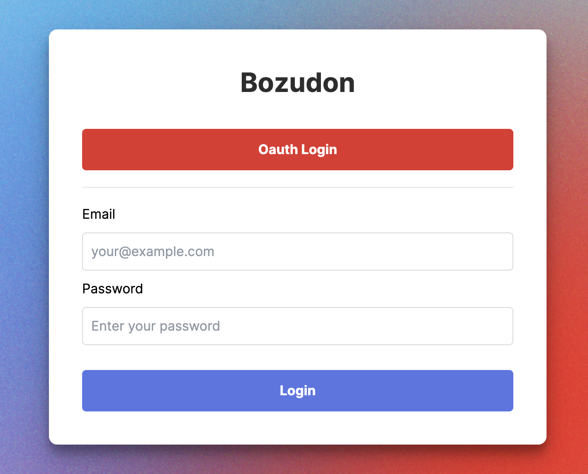
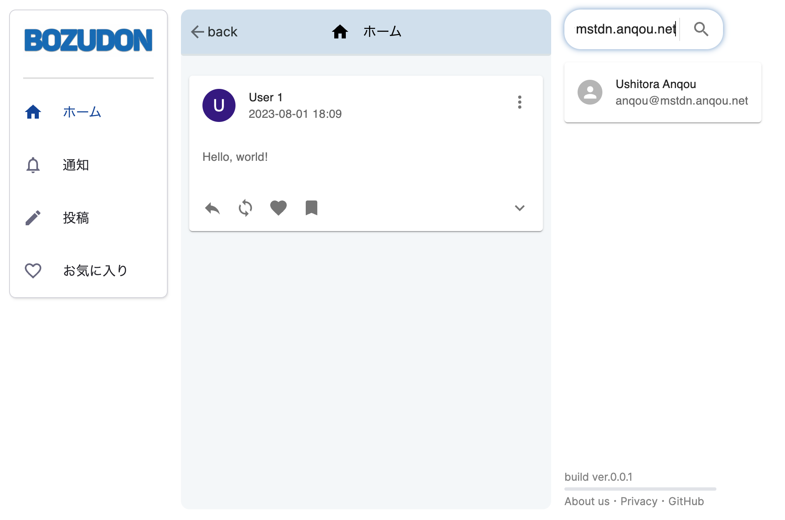

# Bozudon

Bozudon is a microblogging service written in Rust. Bozudon supports ActivityPub (AP), so it can communicate with other AP implementations such as Mastodon.

## Usage

You need to install `docker compose` beforehand. Execute `run.sh` to launch Bozudon in your local environment, and access http://localhost:8080. You can log in the service with the email `user1@example.com` and the password `password`.

## LICENSE

> MIT License
> 
> Copyright (c) 2023 KIM Tae Hun, Koki Fukuda, Kyosuke Miyamura, Ryo Matsukawa, and Ryotaro Banno
> 
> Permission is hereby granted, free of charge, to any person obtaining a copy
> of this software and associated documentation files (the "Software"), to deal
> in the Software without restriction, including without limitation the rights
> to use, copy, modify, merge, publish, distribute, sublicense, and/or sell
> copies of the Software, and to permit persons to whom the Software is
> furnished to do so, subject to the following conditions:
> 
> The above copyright notice and this permission notice shall be included in all
> copies or substantial portions of the Software.
> 
> THE SOFTWARE IS PROVIDED "AS IS", WITHOUT WARRANTY OF ANY KIND, EXPRESS OR
> IMPLIED, INCLUDING BUT NOT LIMITED TO THE WARRANTIES OF MERCHANTABILITY,
> FITNESS FOR A PARTICULAR PURPOSE AND NONINFRINGEMENT. IN NO EVENT SHALL THE
> AUTHORS OR COPYRIGHT HOLDERS BE LIABLE FOR ANY CLAIM, DAMAGES OR OTHER
> LIABILITY, WHETHER IN AN ACTION OF CONTRACT, TORT OR OTHERWISE, ARISING FROM,
> OUT OF OR IN CONNECTION WITH THE SOFTWARE OR THE USE OR OTHER DEALINGS IN THE
> SOFTWARE.

## Disclaimer

This OSS is our own personal work and does not have any relationship with Cybozu, Inc. or any other organization which we belong to.
